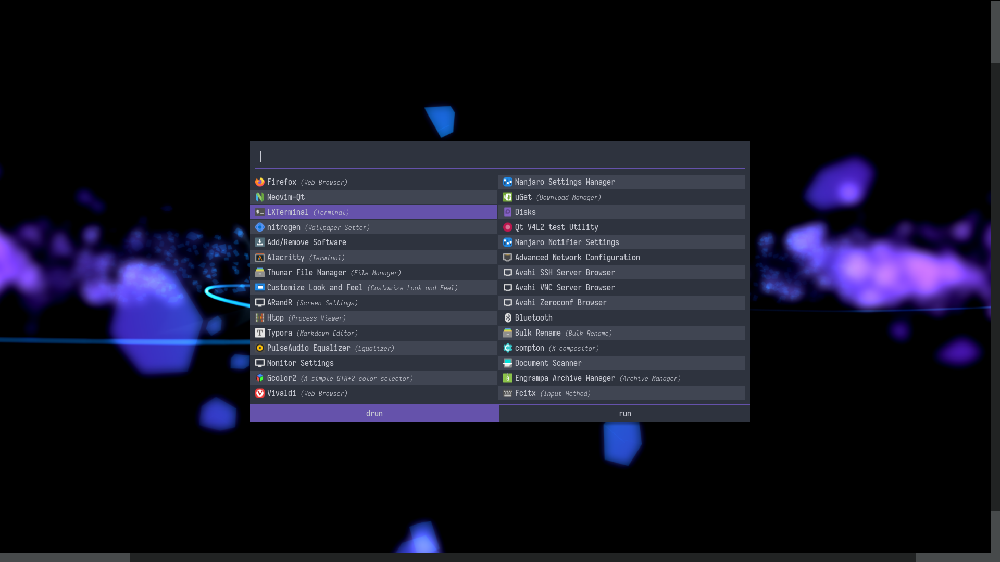
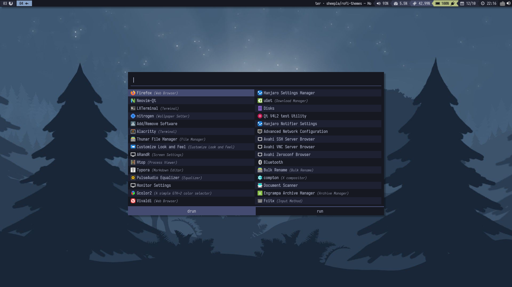
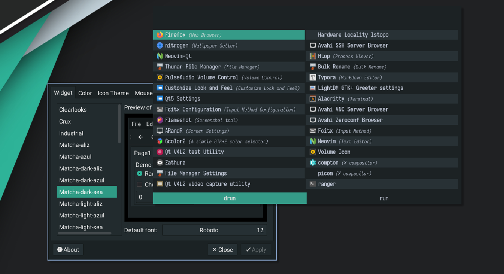
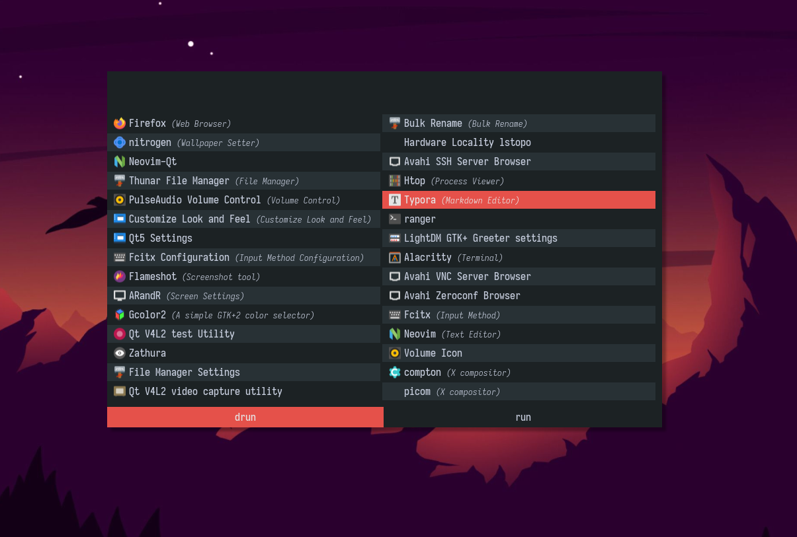

# rofi-themes

Simple theme of rofi (window switcher / launcher)

## Themes

### Alter

Inspired by [Alter Linux](https://fascode.net/projects/linux/alter/) artworks (Not official!)

### Iceberg Dark

Color palette by [iceberg.vim](https://github.com/cocopon/iceberg.vim) and [iceberg-dark](https://github.com/gkeep/iceberg-dark) .

### Iceberg Light

Light version of iceberg theme.

### Matcha Dark Sea

### Matcha Dark Aliz

## Installation

1. Copy to `~/.config/rofi/themes/`
2. select theme with `rofi-theme-selecter`. 
3. `Alt-A` to accept a theme.
